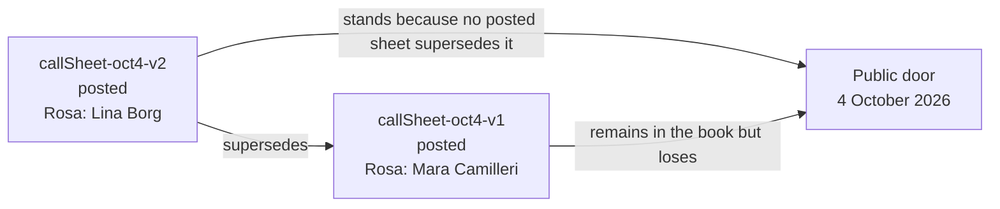
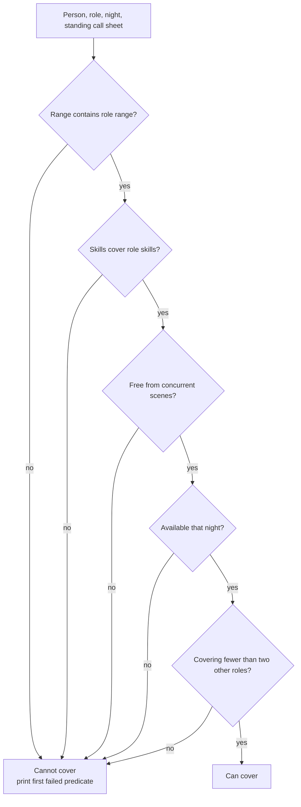

# Salt Wharf Design Notes

Salt Wharf treats a posted call sheet as a notice on a theatre callboard. A later posted notice can replace an earlier posted notice without deleting it.

## Later Sheet Wins

For one performance date, the door looks at posted sheets only. If a posted sheet is named by another posted sheet's `supersedes` reference, it is still part of the record but it is not the standing sheet.

## Coverage Computation

Coverage is computed from the company data each time. It is not a stored understudy list.
